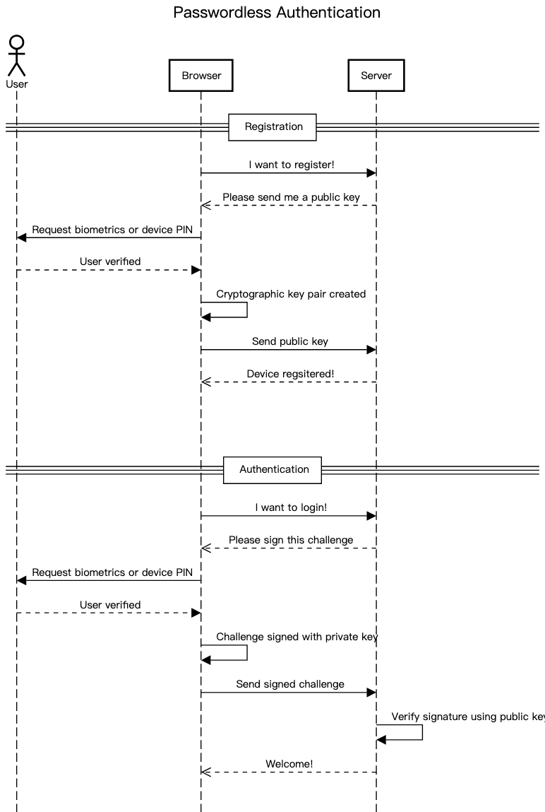
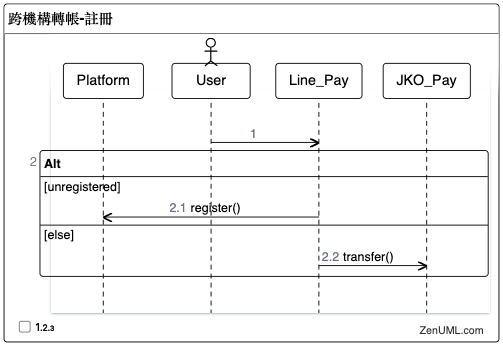
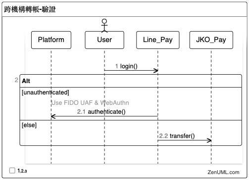

# FIDO Inter-Agency Transfer (跨機構轉帳)

## 介紹
- 透過 FIDO2 規範，利用 WebAuthn 協定 ，來模擬實作跨機構轉帳服務
- Attestation (註冊) &  Assertion (驗證) 流程
  + 
  + (參考[Passwordless.ID / webauthn](https://github.com/passwordless-id/webauthn?tab=readme-ov-file#how-does-the-protocol-work))

## 系統架構圖 (ZenUML 的循序圖)
### 跨機構轉帳-註冊
- 

### 跨機構轉帳-驗證
- 

## 問題
- Macbook Touch ID 作為 Authenticator，經過 SimpleWebAuthnServer.verifyAuthenticationResponse() 驗證後，理論上 `verification.authenticator.authenticationInfo.newCounter` 應該要自動 +1，以防止重放攻擊。但實際上並沒有自動 +1

## 知識點
1. FIDO UAF 與 Webauthn 是用什麼加密演算法，來產生公、私鑰? (e.g. 橢圓曲線演算法、RSA 非對稱式加密演算法)
> GitHub Copilot Chat: 加密演算法：FIDO UAF 和 WebAuthn 都支援多種公鑰加密演算法，包括橢圓曲線密碼學（ECC）和 RSA。具體使用哪種演算法取決於實現和設備的能力。例如，WebAuthn 在其規範中明確提到了對 ES256（橢圓曲線數位簽名演算法）的支援。

> ChatGPT: FIDO UAF 與 WebAuthn 加密演算法:
FIDO UAF和WebAuthn均支持多種加密演算法，包括橢圓曲線演算法（Elliptic Curve Cryptography, ECC）和RSA非對稱式加密演算法。具體使用哪種演算法取決於安全要求和相容性考量。例如，ECC（如ECDSA或EdDSA）因其高效性和較短的密鑰長度而廣泛被使用。

2. FIDO UAF 與 Webauthn 產生的私鑰，是儲存在哪邊呢? (e.g. TPM, 瀏覽器, 資料庫)
> GitHub Copilot Chat: 私鑰儲存位置：FIDO UAF 和 WebAuthn 產生的私鑰通常儲存在用戶的設備上，並且由硬體安全模組（如 TPM）或安全的操作系統元件（如 Android 的 Keystore）保護。私鑰不會離開用戶的設備，也不會被儲存在伺服器或資料庫中。在 MacBook 上，私鑰可能會被儲存在 Secure Enclave 中，這是一個專門用於處理敏感數據的硬體區域。

> ChatGPT: 在Macbook上，FIDO UAF和WebAuthn產生的私鑰通常儲存在Secure Enclave中。Secure Enclave是蘋果設備中的一個安全區域，用於安全地處理敏感數據，包括加密密鑰的生成和存儲。這個特性可以在許多搭載Touch ID的蘋果產品中找到，如部分MacBook Pro型號。

3. FIDO UAF 與 Webauthn 是利用 macbook pro 的什麼 library 來產生私鑰?
> GitHub Copilot Chat: 產生私鑰的 library：在 macOS 上，FIDO UAF 和 WebAuthn 可以使用內建的安全框架（如 Security Framework 或 CryptoKit）來產生和管理私鑰。具體使用哪個框架取決於實現和設備的能力。請注意，這些操作通常由瀏覽器或其他客戶端軟體處理，並且對於網頁開發者來說是透明的。

> ChatGPT: 在MacBook Pro上生成私鑰，通常會使用蘋果的安全框架，如CryptoKit或Security Framework。這些庫提供了一系列的API，允許開發者進行加密操作，包括生成和管理密鑰。特別是，這些API可以與Secure Enclave互動，以安全地處理私鑰。

## TODO
- [x] controller 的 **line_pay_attestation_options_post** API 的 `discoverable_credential`, `hints` 參數，需要傳入到 **SimpleWebAuthnServer.generateRegistrationOptions()** 中
- [x] 實作跨機構身份驗證: 登入有一把私鑰，當要跨機構轉帳時，能用另一把私鑰做驗證
- [ ] 實作 Jko_Pay

## TO Fix
- [ ] 使用者失去 `jwt`, `fvToken` 時，會無法重新登入，待查原因是什麼？

## 參考資料
- FIDO
  + [Notion: FIDO 術語表](https://www.notion.so/FIDO-bd124640609d4afb9a2a23760e05439f#f8f41c4961234f61a831d474b91e5d3a)
  + [FIDO UAF Architectural Overview v1.2](https://fidoalliance.org/specs/fido-uaf-v1.2-ps-20201020/fido-uaf-overview-v1.2-ps-20201020.html)
  + [FIDO UAF Protocol Specification v1.2](https://fidoalliance.org/specs/fido-uaf-v1.2-ps-20201020/fido-uaf-protocol-v1.2-ps-20201020.html)
  + [Web Authentication: An API for accessing Public Key Credentials Level 3](https://w3c.github.io/webauthn/)
- WebAuthn
  + Client: [WebAuthn.io](https://webauthn.io/)
  + Server: [Duo-labs/webauthn.io (using Python)](https://github.com/duo-labs/webauthn.io?tab=readme-ov-file)
  + Libraries
    * [SimpleWebAuthn](https://github.com/MasterKale/SimpleWebAuthn)
      * [@simplewebauthn/browser](https://github.com/MasterKale/SimpleWebAuthn/tree/master/packages/browser)
      * [@simplewebauthn/server](https://github.com/MasterKale/SimpleWebAuthn/tree/master/packages/server)
      * [@simplewebauthn/types](https://github.com/MasterKale/SimpleWebAuthn/tree/master/packages/types/)
      * [example/fido-conformance](https://github.com/MasterKale/SimpleWebAuthn/blob/master/example/fido-conformance.ts)
      * [example/index](https://github.com/MasterKale/SimpleWebAuthn/blob/master/example/index.ts)
  + [Passwordless.ID / webauthn](https://github.com/passwordless-id/webauthn)
- MacOS
  + [Apple 推行通行密鑰 (passkey)](http://www.applemobility.tw/2023/03/27/apple-%E6%8E%A8%E8%A1%8C%E9%80%9A%E8%A1%8C%E5%AF%86%E9%91%B0/)
- Bootstrap
  + [Bootstrap 5](https://bootstrap5.hexschool.com/)
- Support
  + [Can I use?](https://caniuse.com/)